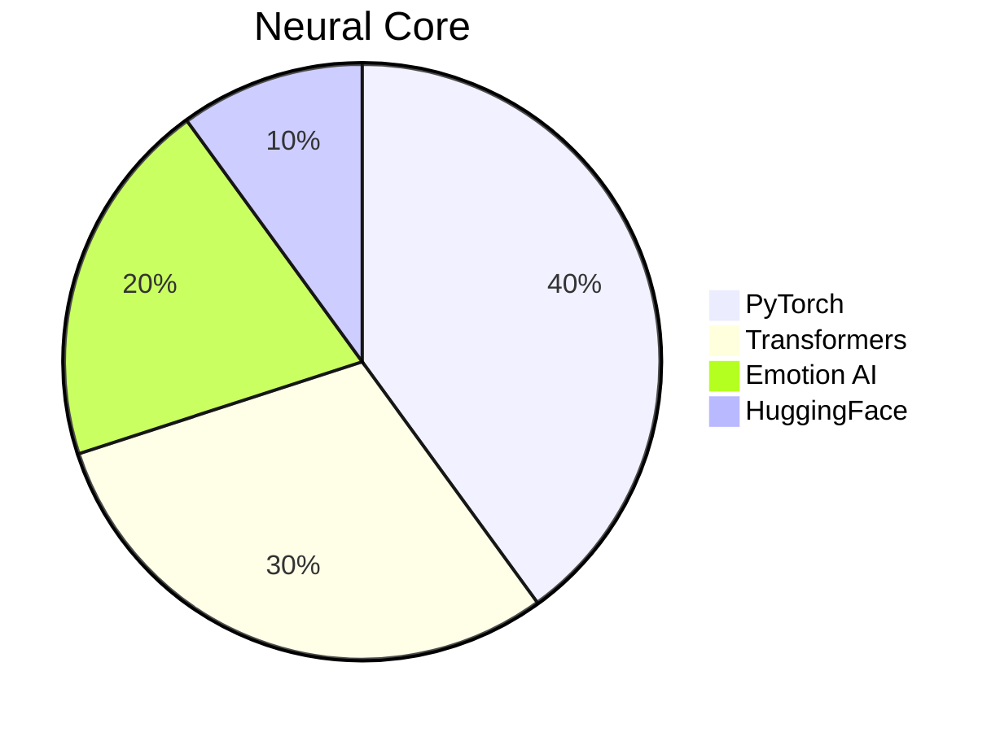
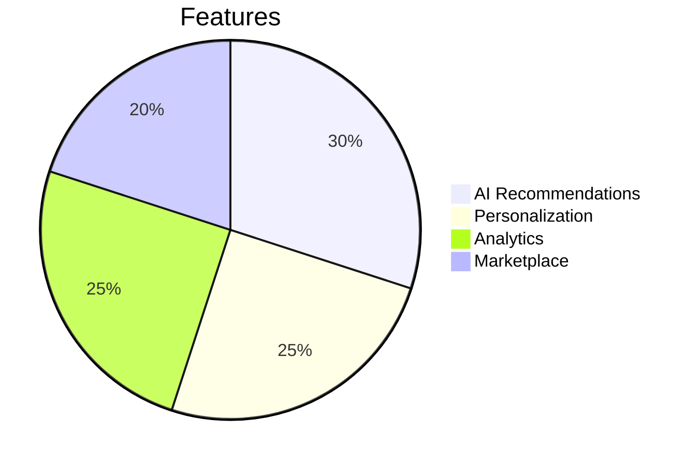
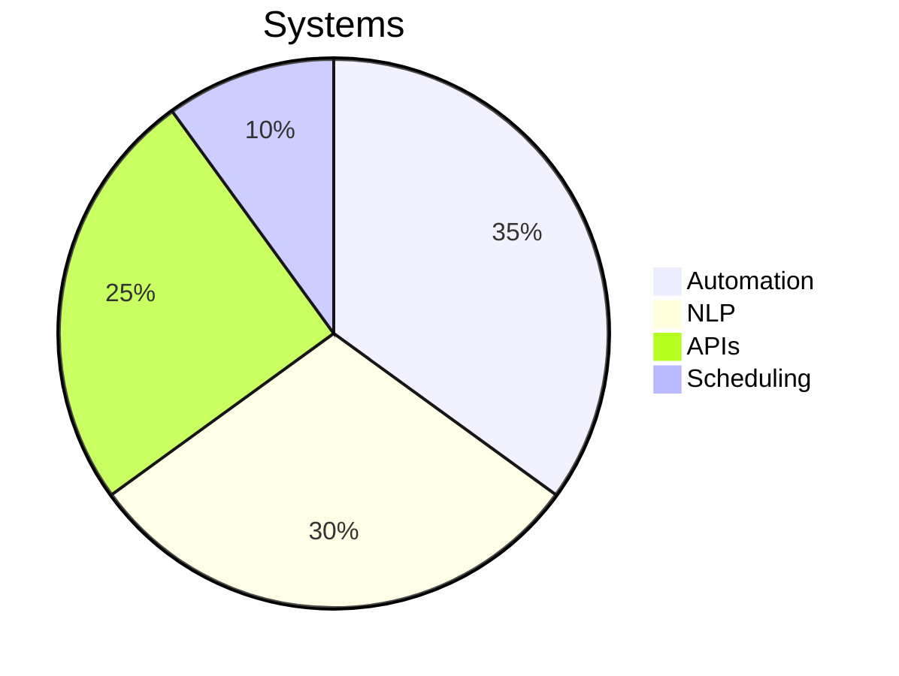
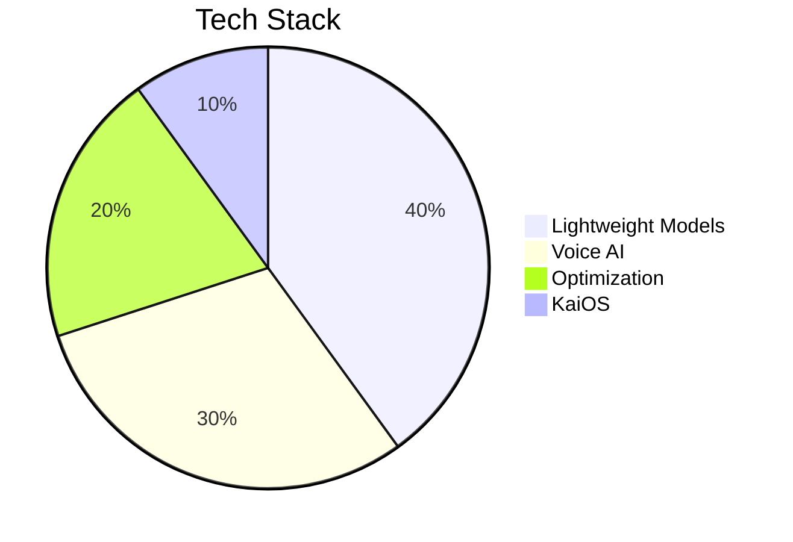
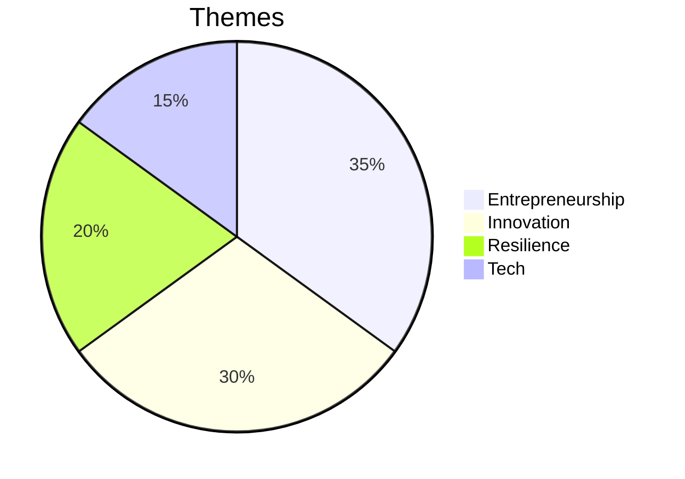
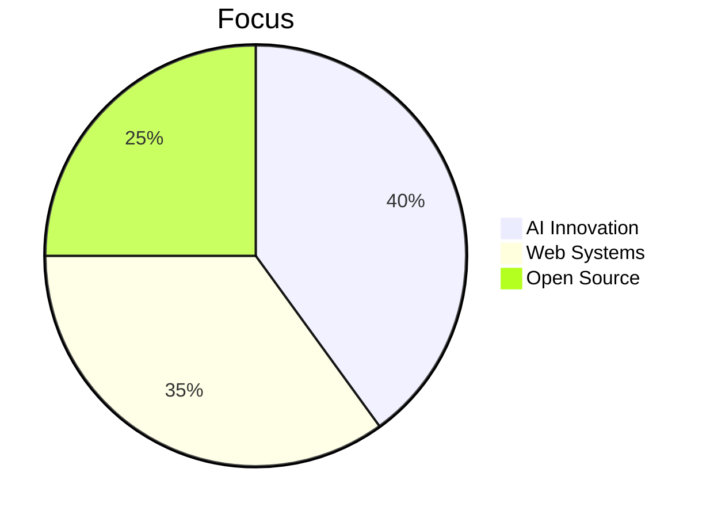

<div align="center">

<!-- Futuristic Header -->


<!-- Typing Animation -->
<p align="center">
  
</p>

<!-- Neon Badges -->
<p align="center">
  
  
  
  
</p>

</div>

---

<div align="center">

## ⚡ CYBERNETIC CORE { AI Visionary • Tech Alchemist • Neon Pioneer }

</div>

<table align="center">
<tr>
<td width="50%" valign="top">

### 🔴 NEON NEXUS

```javascript
class VaibhavVerma extends CyberPioneer {
  constructor() {
    super();
    this.identity = "Vaibhav Verma";
    this.domain = "Neon Upside Down 🌌";
    this.missions = [
      "⚡ NOVA-3B: Emotion-Aware AI",
      "🛍️ INSCIPE: AI Commerce Grid",
      "🤖 JARVIS: Automation Core",
      "📚 Arjun's Journey: Digital Saga"
    ];
  }

  get cyberCycle() {
    return {
      dawn: "☕ Fuel + Code Fusion",
      midday: "🔥 Deploy Neural Systems",
      dusk: "📡 Optimize & Innovate",
      night: "🌌 Dream in AI Matrices"
    };
  }

  get coreDirectives() {
    return [
      "🤖 AI/LLM Mastery",
      "🛠️ Full Stack Supremacy",
      "⚡ Prompt Engineering Precision",
      "🚀 Entrepreneurial Cosmos"
    ];
  }
}
```

</td>
<td width="50%" valign="top">

### 🌌 QUANTUM HORIZON

```python
class NeonVision:
    def __init__(self):
        self.focus = {
            "AI_Nexus": ["LLMs", "Emotion AI", "Automation"],
            "Tech_Grid": ["Next.js", "FastAPI", "MongoDB"],
            "Creative_Core": ["Music", "Writing", "Design"],
            "Hardware": ["Arduino", "Raspberry Pi"]
        }
        
    def cyber_philosophy(self):
        return """
        ⚡ Ignite the Future
        🌌 Merge Code & Creativity
        🚀 Build with Cosmic Intent
        🔴 Pulse with Neon Passion
        """
    
    def neon_motto(self):
        print("From Code to Cosmos 🌌")
        print("Neon Dreams, Infinite Impact 🔴")
```

</td>
</tr>
</table>

---

<div align="center">

## 🌐 NEON NETWORK LINKS

<p>
  <a href="https://vaibhav-verma.netlify.app"></a>
  <a href="mailto:v.v.a.i.b.h.a.v.2233@gmail.com"></a>
  <a href="https://www.linkedin.com/in/vaibhav-verma-6548802a1/"></a>
  <a href="https://www.instagram.com/vaibhav_verma25_/"></a>
  <a href="https://huggingface.co/VAIBHAV22334455"></a>
  <a href="https://github.com/vaibhav2225"></a>
</p>


</div>

---

## 🎨 NEON TECH MATRIX

<div align="center">

### ⚡ Programming & Development
<p>
  
</p>

### 🗄️ Databases & Data Tools
<p>
  
  <span style="color: #ff0000;">+ CockroachDB, CSV, SQL, JSON, Alpaca-Type Data</span>
</p>

### 🤖 AI & Machine Learning
<p>
  
  <span style="color: #ff0000;">+ GPT, BERT, LLaMA, Transformers, CNNs, RNNs, GANs, Prompt Engineering, NLP</span>
</p>

### 🛠️ Tools & Infrastructure
<p>
  
  <span style="color: #ff0000;">+ Raspberry Pi, Arduino</span>
</p>

### 📱 Mobile & IoT
<p>
  
  <span style="color: #ff0000;">+ KaiOS, PWA</span>
</p>

### 🔒 Security
<p>
  <span style="color: #ff0000;">JWT, OAuth2, Encryption, SSL/TLS</span>
</p>

### 📊 Data & Analytics
<p>
  <span style="color: #ff0000;">Visualization, BI Tools, Big Data Processing</span>
</p>

### 🌐 APIs & Integrations
<p>
  
  <span style="color: #ff0000;">+ OpenAI, Hugging Face, Google, Stripe, Twilio</span>
</p>

### 🎨 Creative Skills
<p>
  <span style="color: #ff0000;">Published Author, Poetry, Sound Design, Music Composition, Photo/Video Editing, Graphic Design</span>
</p>

### 🚀 Entrepreneurship
<p>
  <span style="color: #ff0000;">Startup Founder, E-commerce, Business Strategy, Marketing, Branding, Product Development</span>
</p>

### 🎮 Gaming & Sports
<p>
  <span style="color: #ff0000;">PC Gaming, Strategic Gameplay, Cricket, Volleyball</span>
</p>


</div>

---

<div align="center">

## 📊 NEON CODE GRID


</div>

<div align="center">
  
  
</div>

<div align="center">
  
  
</div>

<div align="center">
  
</div>

---

<div align="center">

## 🎯 NEON MISSIONS

<table>
<tr>
<td align="center" width="33%">

### ⚡ NOVA-3B
*Emotion-Aware LLM*


**Status:** 🟢 Active

</td>
<td align="center" width="33%">

### 🛍️ INSCIPE
*Neon Commerce Grid*


**Status:** 🟢 Live

</td>
<td align="center" width="33%">

### 🤖 JARVIS
*Automation Nexus*


**Status:** 🟢 Active

</td>
</tr>
<tr>
<td align="center" width="33%">

### 📱 AI for KaiOS
*Low-Resource AI*


**Status:** 🟢 Active

</td>
<td align="center" width="33%">

### 📚 Arjun's Journey
*Digital Chronicle*


**Status:** 📖 Published

</td>
<td align="center" width="33%">

### 🚀 Next Frontier
*Future Constructs*


**Status:** 🔵 Planning

</td>
</tr>
</table>


</div>

---

<div align="center">

## 🏆 NEON ACHIEVEMENTS

<table>
<tr>
<td align="center" width="25%">

<br><strong>Projects</strong>
<br><h3>50+</h3>
</td>
<td align="center" width="25%">

<br><strong>Commits</strong>
<br><h3>500+</h3>
</td>
<td align="center" width="25%">

<br><strong>Stars</strong>
<br><h3>100+</h3>
</td>
<td align="center" width="25%">

<br><strong>Contributions</strong>
<br><h3>200+</h3>
</td>
</tr>
</table>


</div>

---

<div align="center">

## 💎 NEON PRINCIPLES

<table align="center">
<tr>
<td align="center" width="25%">

<br><strong>Innovation</strong>
<br><sub>Redefine the Future</sub>
</td>
<td align="center" width="25%">

<br><strong>Integrity</strong>
<br><sub>Code with Honor</sub>
</td>
<td align="center" width="25%">

<br><strong>Impact</strong>
<br><sub>Create Lasting Change</sub>
</td>
<td align="center" width="25%">

<br><strong>Inclusivity</strong>
<br><sub>Tech for All</sub>
</td>
</tr>
</table>


</div>

---

<div align="center">

## 🎵 NEON SOUNDWAVE

<p>
  
  <a href="https://open.spotify.com/track/29d0nY7TzCoi22XBqDQkiP?si=2e402c0bac604e12"></a>
  <!-- Neon Equalizer Animation -->
  
</p>

*Stranger Things Anthem — Pulsing through the neon cosmos, defying all limits.*

</div>

---

<div align="center">

## 🐍 NEON CODE STREAM

<picture>
  <source media="(prefers-color-scheme: dark)" srcset="https://raw.githubusercontent.com/vaibhav2225/vaibhav2225/output/github-contribution-grid-snake-dark.svg">
  <source media="(prefers-color-scheme: light)" srcset="https://raw.githubusercontent.com/vaibhav2225/vaibhav2225/output/github-contribution-grid-snake.svg">
  
</picture>


</div>

---

<div align="center">

## 💌 IGNITE THE NEON FUTURE!

<p>
  <strong>🌌 Open for AI missions, startup ventures, and creative collabs!</strong>
</p>

<p>
  
  
  
</p>

### 🔴 Directive: Code the Cosmos, Transcend the Ordinary

**⭐ Drop a star to join the neon uprising!**  
**🤝 Let’s forge the future in the Upside Down!**

---


*"The neon pulse of code shapes a future beyond the stars."* - Vaibhav Verma

**Crafted with ⚡ and ☕ in the Neon Upside Down**

</div>
