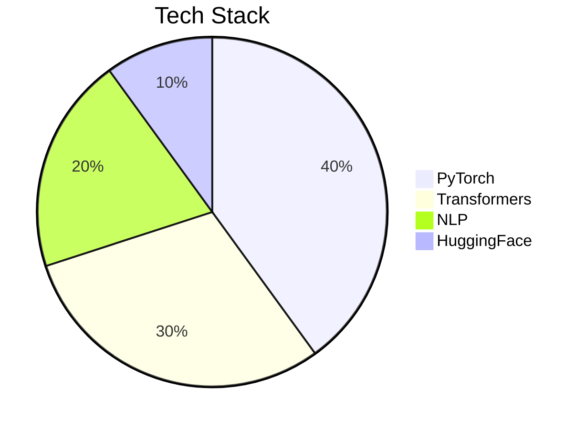
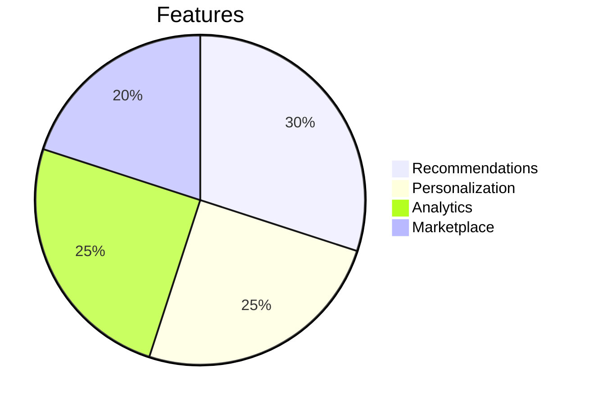
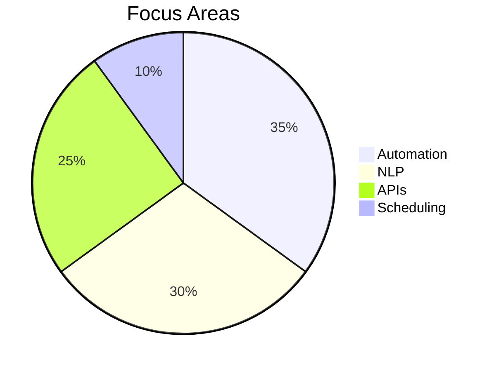
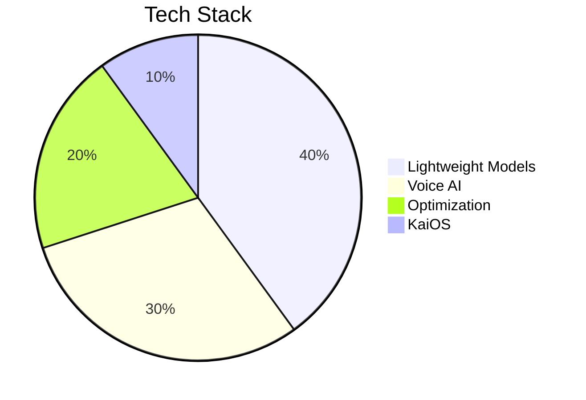
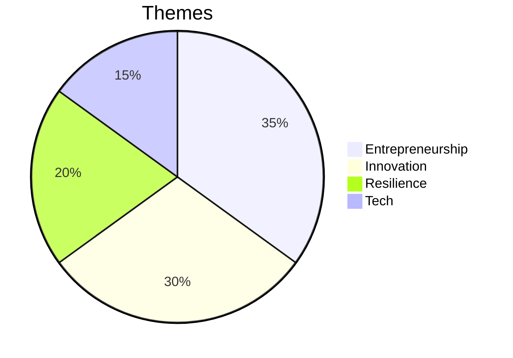
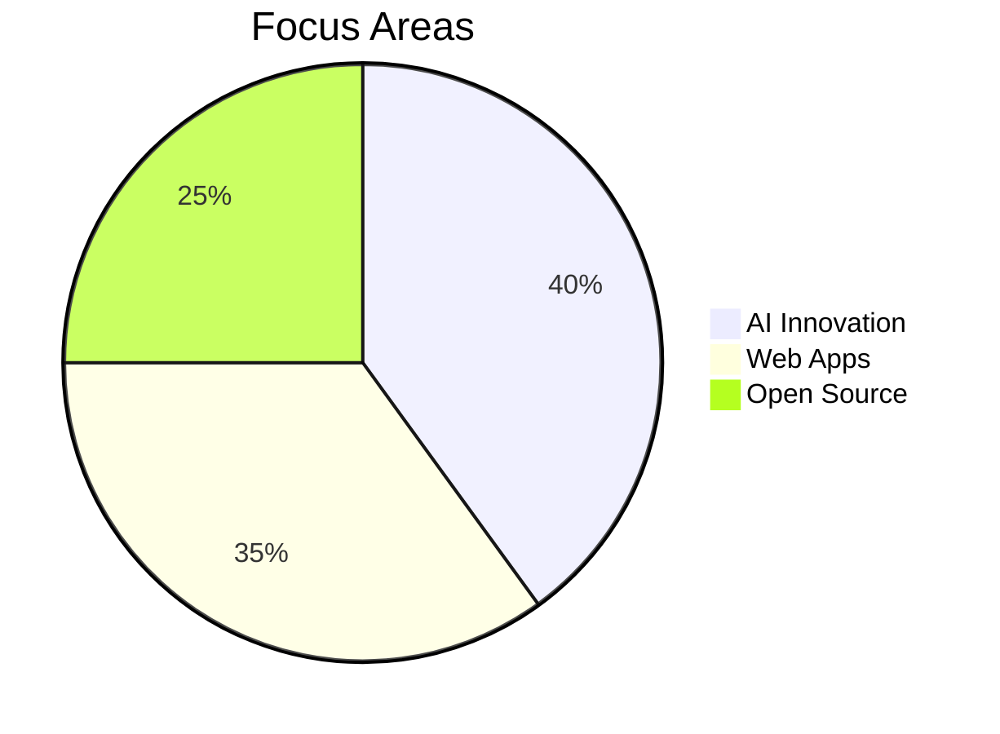

<div align="center">

<!-- Animated Header -->


<!-- Typing Animation -->
<p align="center">
  
</p>

<!-- Animated Badges -->
<p align="center">
  
  
  
</p>

</div>

---

<div align="center">

## 🧬 DNA { AI Engineer • Full Stack Dev • Entrepreneur }

</div>

<table align="center">
<tr>
<td width="50%" valign="top">

### 🎯 Mission Control

```javascript
class Vaibhav extends Innovator {
  constructor() {
    super();
    this.name = "Vaibhav Verma";
    this.role = "AI & Full Stack Alchemist";
    this.location = "Upside Down 🌌";
    this.currentMission = [
      "🔮 NOVA-3B - Emotion-Aware LLM",
      "🛍️ INSCIPE - AI-Powered Ecommerce",
      "🤖 JARVIS - Automation Protocol"
    ];
  }

  get dailyRoutine() {
    return {
      morning: "☕ Coffee + Code",
      afternoon: "⚡ Build AI Models",
      evening: "📚 Innovate & Experiment",
      night: "🌙 Dream in Python"
    };
  }

  getSkillSet() {
    return [
      "AI/ML Master 🤖",
      "Full Stack Wizard 🛠️",
      "Prompt Engineering Guru ⚡",
      "Entrepreneurial Visionary 🚀"
    ];
  }
}
```

</td>
<td width="50%" valign="top">

### 🌈 Current Universe

```python
class CurrentlyExploring:
    def __init__(self):
        self.learning = {
            "AI_ML": ["LLMs", "Transformers", "Emotion Recognition"],
            "Frontend": ["Next.js", "React", "Tailwind CSS"],
            "Backend": ["Node.js", "FastAPI", "MongoDB"],
            "DevOps": ["Docker", "AWS", "CI/CD"]
        }
        
    def life_philosophy(self):
        return """
        🎮 Innovate with Passion
        📚 Learn Relentlessly
        🚀 Build for Impact
        💡 Dream Beyond Limits
        """
    
    def motto(self):
        print("Transform Ideas into Reality 🌌")
        print("Bridge Human & AI with Code 🔴")
```

</td>
</tr>
</table>

---

<div align="center">

## 🌐 Connect Across the Upside Down

<p>
  <a href="https://vaibhav-verma.netlify.app"></a>
  <a href="mailto:v.v.a.i.b.h.a.v.2233@gmail.com"></a>
  <a href="https://www.linkedin.com/in/vaibhav-verma-6548802a1/"></a>
  <a href="https://www.instagram.com/vaibhav_verma25_/"></a>
  <a href="https://huggingface.co/VAIBHAV22334455"></a>
  <a href="https://github.com/vaibhav2225"></a>
</p>


</div>

---

## 🎨 Tech Palette & Toolbox

<div align="center">

### ⚡ Core Languages
<p>
  
</p>

### 🚀 Frameworks & Libraries
<p>
  
</p>

### 🗄️ Databases & Backend
<p>
  
</p>

### 🛠️ DevOps & Tools
<p>
  
</p>

### 🤖 AI/ML Arsenal
<p>
  
</p>


</div>

---

<div align="center">

## 📊 GitHub Constellation


</div>

<div align="center">
  
  
</div>

<div align="center">
  
  
</div>

<div align="center">
  
</div>

---

<div align="center">

## 🎯 Featured Projects & Quests

<table>
<tr>
<td align="center" width="33%">

### ⚡ NOVA-3B
*Emotion-Aware LLM*


**Status:** 🟢 Active Development

</td>
<td align="center" width="33%">

### 🛍️ INSCIPE
*AI-Powered Ecommerce*


**Status:** 🟢 Live

</td>
<td align="center" width="33%">

### 🤖 JARVIS
*Automation Protocol*


**Status:** 🟢 Active

</td>
</tr>
<tr>
<td align="center" width="33%">

### 📱 AI for KaiOS
*AI for Feature Phones*


**Status:** 🟢 Active

</td>
<td align="center" width="33%">

### 📚 Arjun's Journey
*Published Book*


**Status:** 📖 Published

</td>
<td align="center" width="33%">

### 🚀 Future Projects
*Coming Soon*


**Status:** 🔵 Planning

</td>
</tr>
</table>


</div>

---

<div align="center">

## 🏆 Achievements & Milestones

<table>
<tr>
<td align="center" width="25%">

<br><strong>Projects Built</strong>
<br><h3>50+</h3>
</td>
<td align="center" width="25%">

<br><strong>Commits</strong>
<br><h3>500+</h3>
</td>
<td align="center" width="25%">

<br><strong>Stars</strong>
<br><h3>100+</h3>
</td>
<td align="center" width="25%">

<br><strong>Contributions</strong>
<br><h3>200+</h3>
</td>
</tr>
</table>


</div>

---

<div align="center">

## 💎 Core Values

<table align="center">
<tr>
<td align="center" width="25%">

<br><strong>Innovation</strong>
<br><sub>Pushing Tech Boundaries</sub>
</td>
<td align="center" width="25%">

<br><strong>Integrity</strong>
<br><sub>Honesty & Transparency</sub>
</td>
<td align="center" width="25%">

<br><strong>Impact</strong>
<br><sub>Solutions That Matter</sub>
</td>
<td align="center" width="25%">

<br><strong>Inclusivity</strong>
<br><sub>Tech for Everyone</sub>
</td>
</tr>
</table>


</div>

---

<div align="center">

## 🎵 Now Playing

<p>
  <a href="https://open.spotify.com/track/29d0nY7TzCoi22XBqDQkiP?si=2e402c0bac604e12"></a>
</p>

*Stranger Things Anthem — Capturing the essence of never giving up, even against impossible odds.*

</div>

---

<div align="center">

## 🐍 Contribution Snake

<picture>
  <source media="(prefers-color-scheme: dark)" srcset="https://raw.githubusercontent.com/vaibhav2225/vaibhav2225/output/github-contribution-grid-snake-dark.svg">
  <source media="(prefers-color-scheme: light)" srcset="https://raw.githubusercontent.com/vaibhav2225/vaibhav2225/output/github-contribution-grid-snake.svg">
  
</picture>


</div>

---

<div align="center">

## 💌 Let's Build Something Extraordinary!

<p>
  <strong>🌟 Open for AI projects, startups, and open-source collabs!</strong>
</p>

<p>
  
  
  
</p>

### 💡 Motto: Innovate, Create, Inspire

**⭐ Drop a star if you vibe with my work!**  
**🤝 Let's connect and conquer the Upside Down!**

---


*"The only way out is through — and on the other side, you'll find something extraordinary."* - Vaibhav Verma

**Made with 🔥 and lots of ☕ in the Upside Down**

</div>
