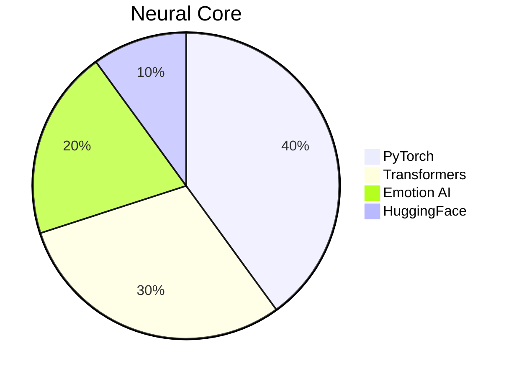
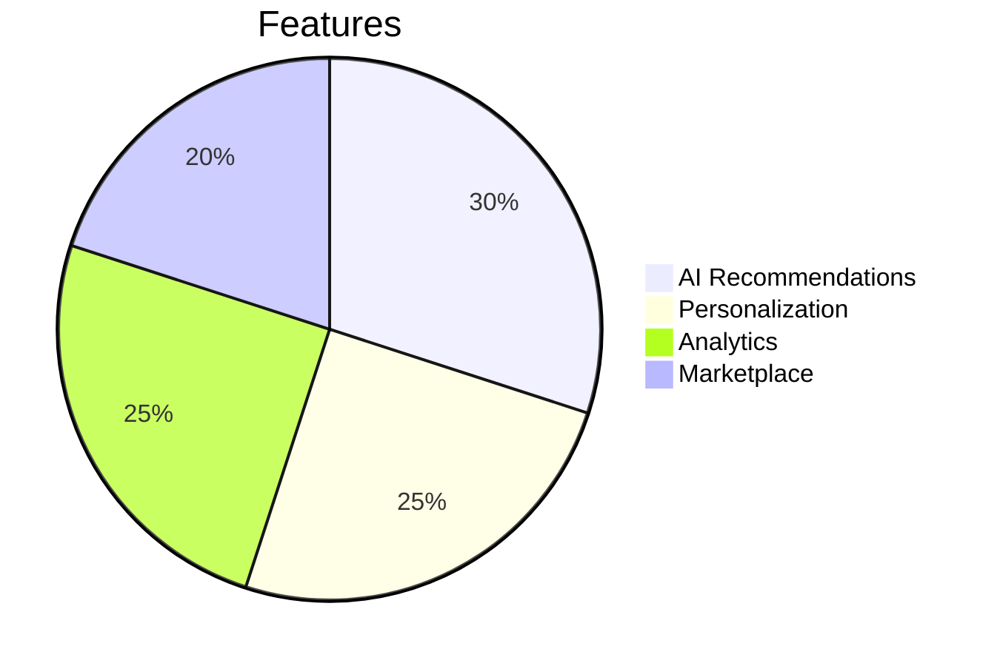
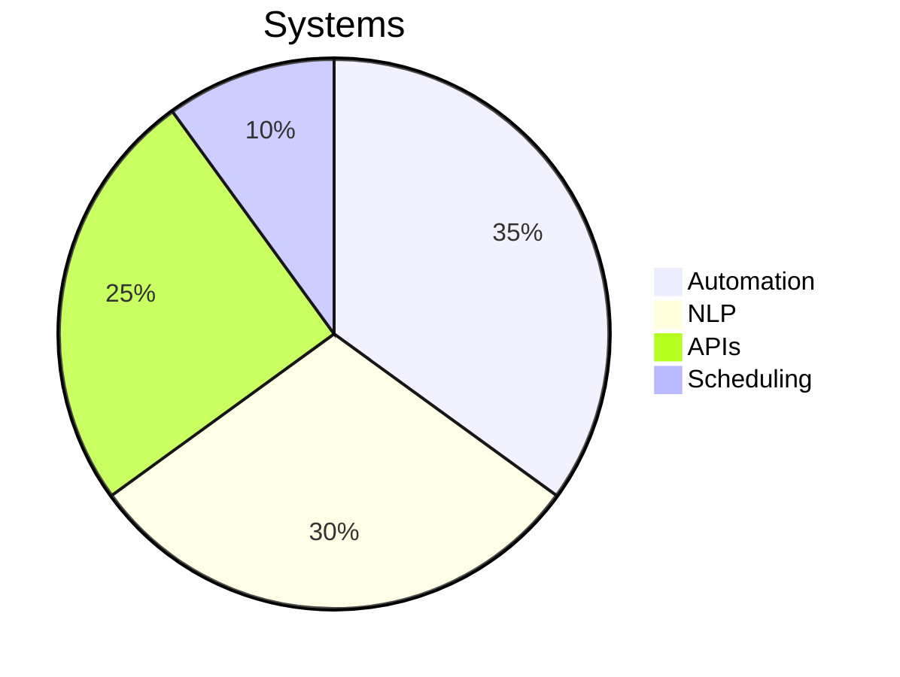
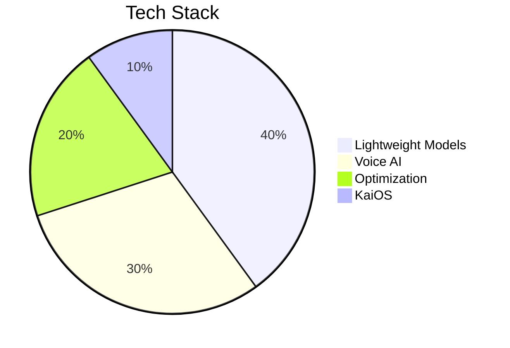
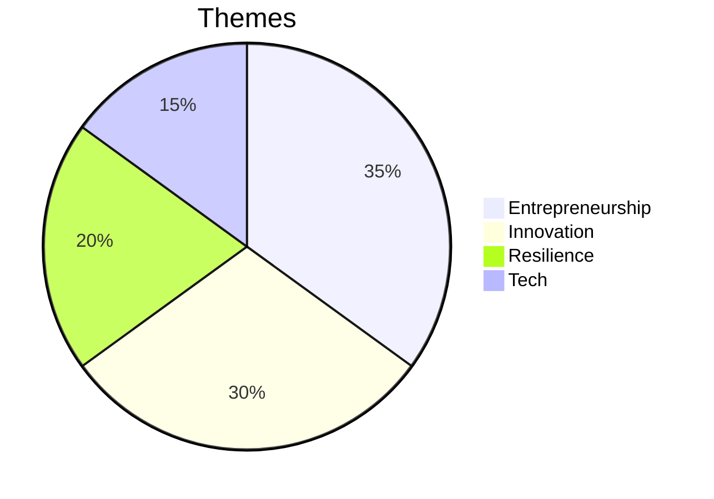
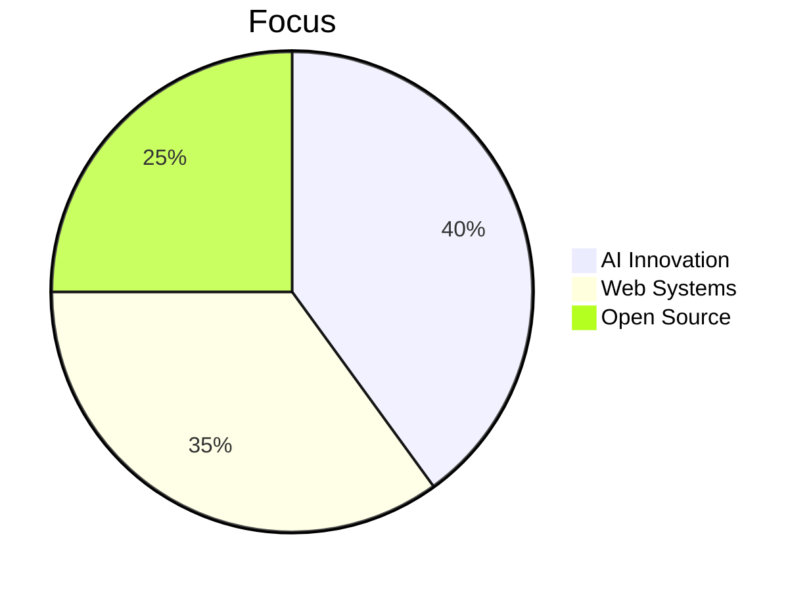

# Vaibhav Verma | Architect of the Upside Down

<div align="center">


  <p style="color: #eb0000ff; font-family: 'Creepster', cursive; font-size: 1.4em; text-shadow: 0 0 10px #FF0000;">
    <strong>⚡ Master of AI Demogorgons | 🌌 Weaver of Quantum Code | 🚀 Builder of Upside Down Systems</strong>
  </p>

  <p>
    
  </p>
</div>


<div align="center">

## <span style="color: #FFFFFF;">⚡ CYBERNETIC ESSENCE { AI Overlord • Neon Architect • Cosmic Innovator }</span>

</div>

<table align="center">
<tr>
<td width="50%" valign="top">

### <span style="color: #FFFFFF;">🔴 NEON CORE</span>

```javascript
class VaibhavVerma extends CosmicInnovator {
  constructor() {
    super();
    this.identity = "Vaibhav Verma";
    this.domain = "Neon Upside Down 🌌";
    this.missions = [
      "⚡ NOVA-3B: Emotion-Aware AI",
      "🛍️ INSCIPE: AI Commerce Matrix",
      "🤖 JARVIS: Automation Core",
      "📚 Arjun's Journey: Digital Epic"
    ];
  }

  get cyberCycle() {
    return {
      dawn: "☕ Fuel + Neural Forge",
      midday: "🔥 Deploy AI Constructs",
      dusk: "📡 Optimize Cyber Systems",
      night: "🌌 Dream in Code Streams"
    };
  }

  get coreDirectives() {
    return [
      "🤖 Master AI & LLMs",
      "🛠️ Architect Full Stack Systems",
      "⚡ Precision Prompt Engineering",
      "🚀 Pioneer Cosmic Ventures"
    ];
  }
}
```

</td>
<td width="50%" valign="top">

### <span style="color: #FFFFFF;">🌌 QUANTUM VISION</span>

```python
class NeonMatrix:
    def __init__(self):
        self.focus = {
            "AI_Nexus": ["LLMs", "Emotion AI", "Automation"],
            "Tech_Grid": ["Next.js", "FastAPI", "MongoDB"],
            "Creative_Void": ["Music", "Writing", "Design"],
            "Hardware_Core": ["Arduino", "Raspberry Pi"]
        }
        
    def cosmic_philosophy(self):
        return """
        ⚡ Ignite Cosmic Innovation
        🌌 Fuse Code & Creativity
        🚀 Build with Neon Intent
        🔴 Pulse Beyond the Stars
        """
    
    def neon_motto(self):
        print("From Code to Cosmos 🌌")
        print("Neon Sparks, Eternal Impact 🔴")
```

</td>
</tr>
</table>


## <span style="color: #f70b0b;">🌐 NEON NETWORK LINKS</span>

<p style="display:flex; flex-wrap:wrap; gap:10px; align-items:center;">
  <a href="https://vaibhav-verma.netlify.app">
    
  </a>

  <a href="mailto:v.v.a.i.b.h.a.v.2233@gmail.com">
    
  </a>

  <a href="https://www.linkedin.com/in/vaibhav-verma-6548802a1/">
    
  </a>

  <a href="https://www.instagram.com/vaibhav_verma25_/">
    
  </a>

  <a href="https://huggingface.co/VAIBHAV22334455">
    
  </a>

  <a href="https://github.com/vaibhav2225">
    
  </a>
</p>


## 🎨 Quantum Skill Matrix

<div align="center" style="background: linear-gradient(45deg, #1C2526, #2D1B1B); padding: 25px; border: 3px solid #FF0000; border-radius: 15px; box-shadow: 0 0 20px #FF0000;">

  <h3 style="color: #FF0000; font-family: 'Creepster', cursive; text-shadow: 0 0 10px #FF0000;">⚡ Programming & Development</h3>
  <p align="center">
    
  </p>

  <h3 style="color: #FF0000; font-family: 'Creepster', cursive; text-shadow: 0 0 10px #FF0000;">🗄️ Databases & Data Tools</h3>
  <p align="center">
    
  </p>

  <h3 style="color: #FF0000; font-family: 'Creepster', cursive; text-shadow: 0 0 10px #FF0000;">🤖 AI & Machine Learning</h3>
  <p align="center">
    
    <br>
    
    
  </p>

  <h3 style="color: #FF0000; font-family: 'Creepster', cursive; text-shadow: 0 0 10px #FF0000;">🛠️ Tools & Infrastructure</h3>
  <p align="center">
    
    <br>
    
    
    
  </p>

  <h3 style="color: #FF0000; font-family: 'Creepster', cursive; text-shadow: 0 0 10px #FF0000;">🎨 Creative & Other Skills</h3>
  <p align="center">
    
    <br>
    
    
  </p>

</div>


## 📊 Quantum Code Matrix

<div align="center" style="background: linear-gradient(45deg, #1C2526, #2D1B1B); padding: 25px; border: 3px solid #FF0000; border-radius: 15px; box-shadow: 0 0 20px #FF0000;">

  <!-- GitHub Trophies -->
  

  <!-- GitHub Stats -->
  

  <!-- Top Languages -->
  

  <!-- GitHub Activity Graph -->
  

</div>


## 🎯 Upside Down Missions

<div align="center">

## <span style="color: #FFFFFF;">🎯 NEON MISSIONS</span>

<table>
<tr>
<td align="center" width="33%">

### <span style="color: #FFFFFF;">⚡ NOVA-3B</span>
*Emotion-Aware LLM*


**Status:** 🟢 Active

</td>
<td align="center" width="33%">

### <span style="color: #FFFFFF;">🛍️ INSCIPE</span>
*Neon Commerce Grid*


**Status:** 🟢 Live

</td>
<td align="center" width="33%">

### <span style="color: #FFFFFF;">🤖 JARVIS</span>
*Automation Nexus*


**Status:** 🟢 Active

</td>
</tr>
<tr>
<td align="center" width="33%">

### <span style="color: #FFFFFF;">📱 AI for KaiOS</span>
*Low-Resource AI*


**Status:** 🟢 Active

</td>
<td align="center" width="33%">

### <span style="color: #FFFFFF;">📚 Arjun's Journey</span>
*Digital Chronicle*


**Status:** 📖 Published

</td>
<td align="center" width="33%">

### <span style="color: #FFFFFF;">🚀 Next Frontier</span>
*Future Constructs*


**Status:** 🔵 Planning

</td>
</tr>
</table>


</div>


## 💎 Quantum Principles

<div align="center" style="background: linear-gradient(45deg, #1C2526, #2D1B1B); padding: 25px; border: 3px solid #FF0000; border-radius: 15px; box-shadow: 0 0 20px #FF0000;">
  <table align="center">
    <tr>
      <td align="center" width="25%">
        
        <br><strong style="color: #FF0000; font-family: 'Creepster', cursive;">Innovation</strong>
        <br><sub style="color: #FFFFFF;">Defy the Upside Down</sub>
        <p></p>
      </td>
      <td align="center" width="25%">
        
        <br><strong style="color: #FF0000; font-family: 'Creepster', cursive;">Integrity</strong>
        <br><sub style="color: #FFFFFF;">Code with Honor</sub>
        <p></p>
      </td>
      <td align="center" width="25%">
        
        <br><strong style="color: #FF0000; font-family: 'Creepster', cursive;">Impact</strong>
        <br><sub style="color: #FFFFFF;">Create Lasting Change</sub>
        <p></p>
      </td>
      <td align="center" width="25%">
        
        <br><strong style="color: #FF0000; font-family: 'Creepster', cursive;">Inclusivity</strong>
        <br><sub style="color: #FFFFFF;">Tech for All</sub>
        <p></p>
      </td>
    </tr>
  </table>
</div>


## 🎵 Synthwave Chronicles

<div align="center" style="background: linear-gradient(45deg, #1C2526, #2D1B1B); padding: 25px; border: 3px solid #FF0000; border-radius: 15px; box-shadow: 0 0 20px #FF0000;">
  <p>
    
    <br>
    
    <br>
    <a href="https://open.spotify.com/track/1PtQJZVZIdWIYdARpZRDFO?si=c5a95b574d5e4492"></a>
  </p>
  <p style="color: #FFFFFF; font-style: italic;">A journey from raw synth beats to an anthem defying the Upside Down.</p>
</div>


## 💌 Forge the Quantum Future

<div align="center" style="background: linear-gradient(45deg, #1C2526, #2D1B1B); padding: 25px; border: 3px solid #FF0000; border-radius: 15px; box-shadow: 0 0 20px #FF0000;">
  <p style="color: #FF0000; font-family: 'Creepster', cursive; font-size: 1.2em;">
    <strong>🌌 Open for AI missions, startup quests, and synthwave collabs!</strong>
  </p>
  <p>
    
    
    
  </p>
  <p style="color: #FF0000; font-family: 'Creepster', cursive;"><strong>🔳 Directive: Code the Upside Down, Ignite Eternity</strong></p>
  <p style="color: #FFFFFF;"><strong>⭐ Drop a star to fuel the quantum revolution! 🤝 Let’s build the future!</strong></p>
</div>


<div align="center">
  
  <p style="color: #FFFFFF; font-style: italic;">"The pulse of quantum code lights the path to the stars." - Vaibhav Verma</p>
  <p style="color: #FFFFFF;"><strong>Crafted with ⚡ and ☕ in the Quantum Forge</strong></p>
</div>
