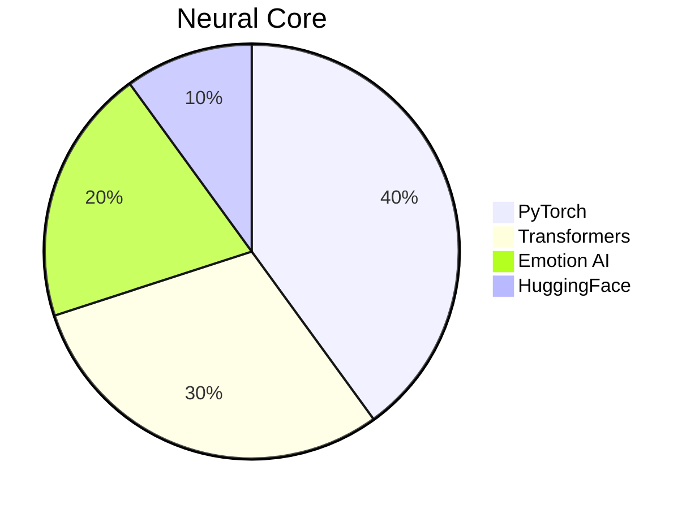
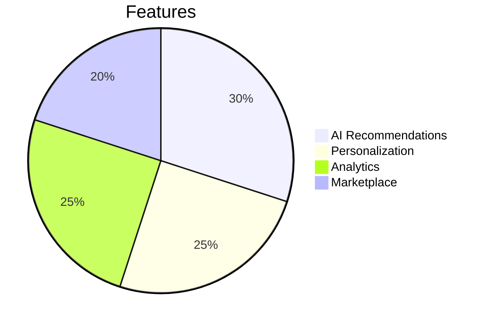
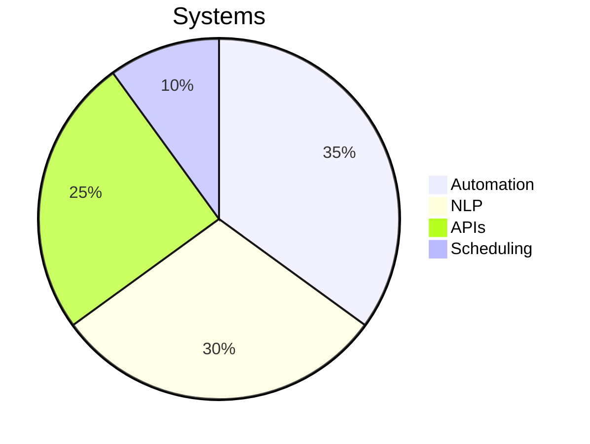
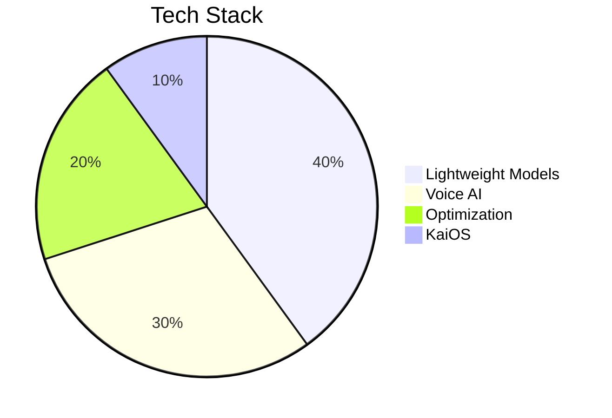
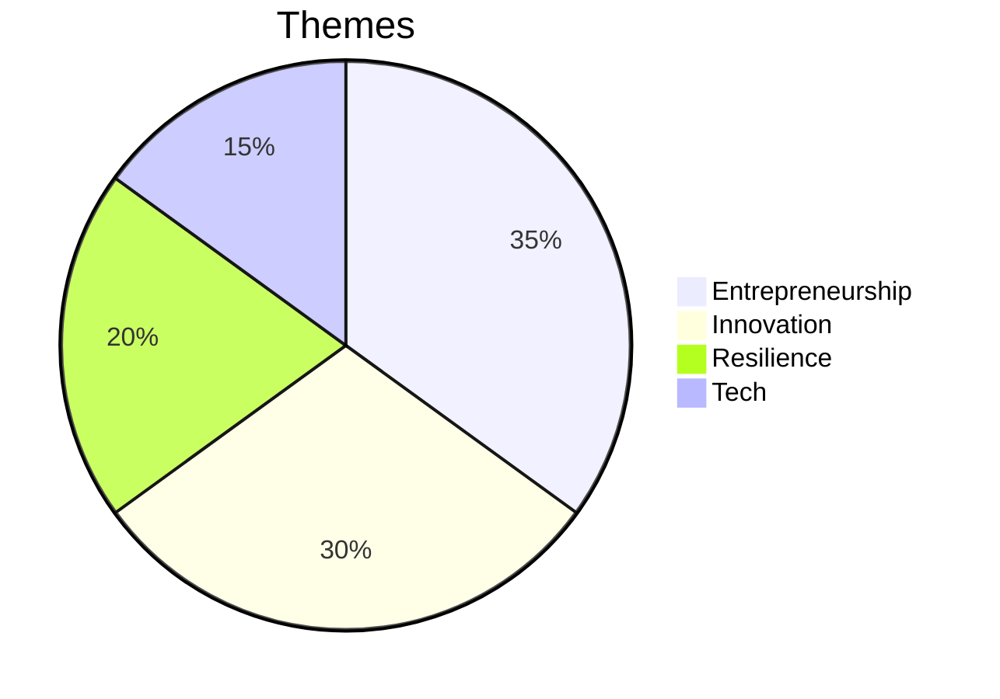
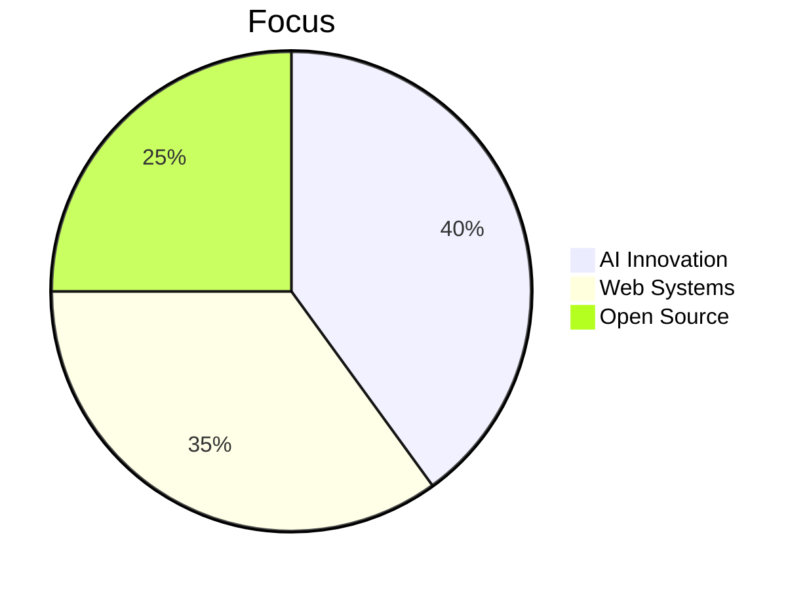

# Vaibhav Verma | Architect of Infinity

  

  

    <strong>Master of AI Realms ⚡ | Weaver of Cosmic Code 🌌 | Builder of Eternal Systems 🚀</strong>
  

  

    
  

---

## ⚡ Core Directive { AI Sovereign • Cosmic Innovator }

<table align="center">
  <tr>
    <td width="50%" valign="top">
      <h3>🔳 Quantum Core</h3>
      <pre><code class="language-javascript">
class VaibhavVerma extends CosmicInnovator {
  constructor() {
    super();
    this.identity = "Vaibhav Verma";
    this.domain = "Neon Upside Down 🌌";
    this.missions = [
      "⚡ NOVA-3B: Emotion-Aware AI",
      "🛍️ INSCIPE: AI Commerce Matrix",
      "🤖 JARVIS: Automation Core",
      "📚 Arjun's Journey: Digital Epic"
    ];
  }

  get cyberCycle() {
    return {
      dawn: "☕ Fuel + Neural Forge",
      midday: "🔥 Deploy AI Constructs",
      dusk: "📡 Optimize Cyber Systems",
      night: "🌌 Dream in Code Streams"
    };
  }

  get coreDirectives() {
    return [
      "🤖 Master AI & LLMs",
      "🛠️ Architect Full Stack Systems",
      "⚡ Precision Prompt Engineering",
      "🚀 Pioneer Cosmic Ventures"
    ];
  }
}
      </code></pre>
    </td>
    <td width="50%" valign="top">
      <h3>🌌 Infinity Matrix</h3>
      <pre><code class="language-python">
class NeonMatrix:
    def __init__(self):
        self.focus = {
            "AI_Nexus": ["LLMs", "Emotion AI", "Automation"],
            "Tech_Grid": ["Next.js", "FastAPI", "MongoDB"],
            "Creative_Void": ["Music", "Writing", "Design"],
            "Hardware_Core": ["Arduino", "Raspberry Pi"]
        }
        
    def cosmic_philosophy(self):
        return """
        ⚡ Ignite Cosmic Innovation
        🌌 Fuse Code & Creativity
        🚀 Build with Precision
        🔳 Pulse Beyond the Stars
        """
    
    def motto(self):
        print("From Code to Cosmos 🌌")
        print("Eternal Impact 🔳")
      </code></pre>
    </td>
  </tr>
</table>

---

## 🌐 Network Links

  
  
  
  
  
  

---

## 🎨 Skill Matrix

  
<strong>⚡ Programming & Development</strong>

  

    
     
    
    
    
  

  
<strong>🗄️ Databases & Data Tools</strong>

  

    
     
    
    
    
    
  

  
<strong>🤖 AI & Machine Learning</strong>

  

    
     
    
    
    
    
    
  

  
<strong>🛠️ Tools & Infrastructure</strong>

  

    
     
    
    
    
  

  
<strong>🎨 Creative & Other Skills</strong>

  

    
    
    
    
    
  

---

## 📊 Code Matrix

  
  
  
  

---

## 🎯 Cosmic Missions

## 🎯 NEON MISSIONS

<table>
<tr>
<td align="center" width="33%">

### ⚡ NOVA-3B
*Emotion-Aware LLM*

**Status:** 🟢 Active

</td>
<td align="center" width="33%">

### 🛍️ INSCIPE
*Neon Commerce Grid*

**Status:** 🟢 Live

</td>
<td align="center" width="33%">

### 🤖 JARVIS
*Automation Nexus*

**Status:** 🟢 Active

</td>
</tr>
<tr>
<td align="center" width="33%">

### 📱 AI for KaiOS
*Low-Resource AI*

**Status:** 🟢 Active

</td>
<td align="center" width="33%">

### 📚 Arjun's Journey
*Digital Chronicle*

**Status:** 📖 Published

</td>
<td align="center" width="33%">

### 🚀 Next Frontier
*Future Constructs*

**Status:** 🔵 Planning

</td>
</tr>
</table>

---

---

## 💎 Principles

<table align="center">
  <tr>
    <td align="center" width="25%">
      
       <strong>Innovation</strong>
       Redefine the Future
      

    </td>
    <td align="center" width="25%">
      
       <strong>Integrity</strong>
       Code with Honor
      

    </td>
    <td align="center" width="25%">
      
       <strong>Impact</strong>
       Create Lasting Change
      

    </td>
    <td align="center" width="25%">
      
       <strong>Inclusivity</strong>
       Tech for All
      

    </td>
  </tr>
</table>

---

## 🎵 Soundwave

  

    
     
    
  

  <pre>
2020: First Beats
2021: Synth Waves
2022: Cosmic Mix
2023: Stranger Pulse
  </pre>
  
<em>Timeline traces the journey from raw beats to eternal defiance.</em>

---

## 💌 Forge the Future

  
<strong>🌌 Open for AI missions, startup quests, and creative collabs!</strong>

  

    
    
    
  

  
<strong>🔳 Directive: Code the Cosmos, Ignite Eternity</strong>

  
<strong>⭐ Drop a star to fuel the revolution! 🤝 Let’s build the future!</strong>

---

  
  
<em>"The pulse of code carves a path to the stars." - Vaibhav Verma</em>

  
<strong>Crafted with ⚡ and ☕ in the Cosmic Forge</strong>

