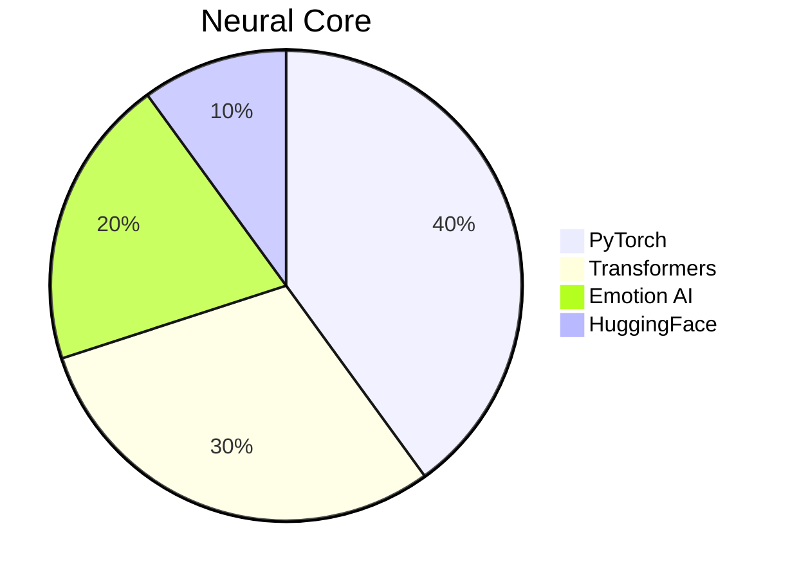
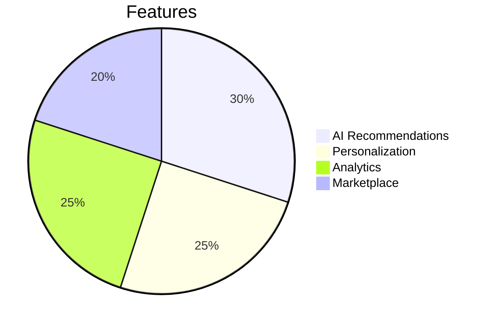
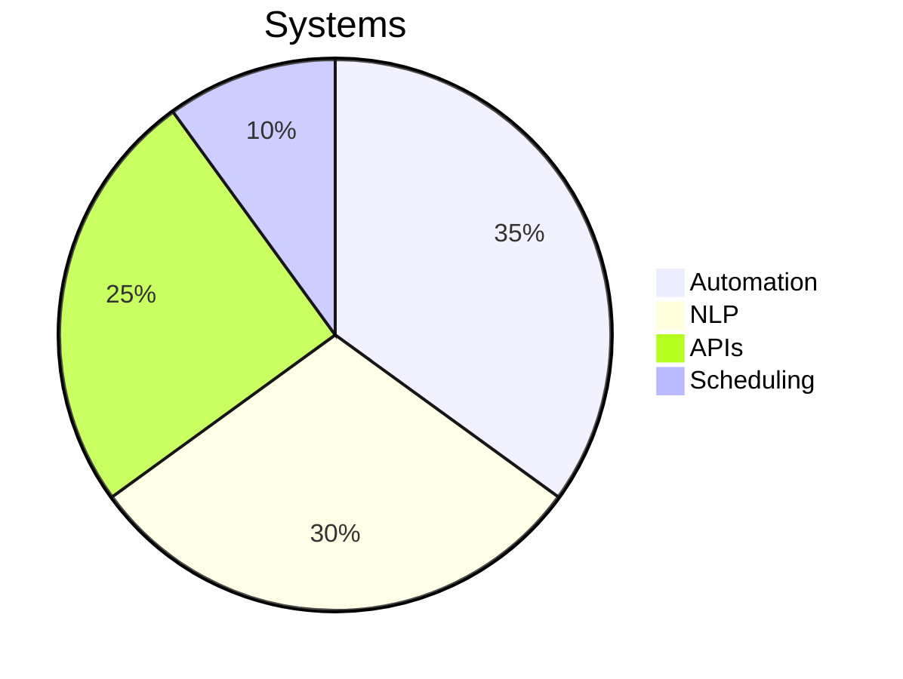

<div align="center">

## <span style="color: #FFFFFF;">🔴 VAIBHAV VERMA</span>

```
   ____ ___ ______   _          _ _       
  | __ )_ _|__  /  | |__   ___| | | ___  
  |  _ \| |  / /   | '_ \ / __| | |/ _ \ 
  | |_) | | / /_   | |_) | (__| | | (_) |
  |____/___/____|  |_.__/ \___|_|_|\___/
  
  NEON ARCHITECT • AI OVERLORD • COSMIC INNOVATOR
```

<!-- Typing Animation -->
<p align="center">
  
</p>

<!-- Neon Badges -->
<p align="center">
  
  
  
  
</p>

</div>

---

<div align="center">

## <span style="color: #FFFFFF;">⚡ CYBERNETIC ESSENCE</span>

</div>

<table align="center">
<tr>
<td width="50%" valign="top">

### <span style="color: #FFFFFF;">🔴 NEON CORE</span>

```javascript
class VaibhavVerma extends CosmicInnovator {
  constructor() {
    super();
    this.identity = "Vaibhav Verma";
    this.domain = "Neon Upside Down 🌌";
    this.missions = [
      "⚡ NOVA-3B: Emotion-Aware AI",
      "🛍️ INSCIPE: AI Commerce Matrix",
      "🤖 JARVIS: Automation Core",
      "📚 Arjun's Journey: Digital Epic"
    ];
  }

  get cyberCycle() {
    return {
      dawn: "☕ Fuel + Neural Forge",
      midday: "🔥 Deploy AI Constructs",
      dusk: "📡 Optimize Cyber Systems",
      night: "🌌 Dream in Code Streams"
    };
  }

  get coreDirectives() {
    return [
      "🤖 Master AI & LLMs",
      "🛠️ Architect Full Stack Systems",
      "⚡ Precision Prompt Engineering",
      "🚀 Pioneer Cosmic Ventures"
    ];
  }
}
```

</td>
<td width="50%" valign="top">

### <span style="color: #FFFFFF;">🌌 QUANTUM VISION</span>

```python
class NeonMatrix:
    def __init__(self):
        self.focus = {
            "AI_Nexus": ["LLMs", "Emotion AI", "Automation"],
            "Tech_Grid": ["Next.js", "FastAPI", "MongoDB"],
            "Creative_Void": ["Music", "Writing", "Design"],
            "Hardware_Core": ["Arduino", "Raspberry Pi"]
        }
        
    def cosmic_philosophy(self):
        return """
        ⚡ Ignite Cosmic Innovation
        🌌 Fuse Code & Creativity
        🚀 Build with Neon Intent
        🔴 Pulse Beyond the Stars
        """
    
    def neon_motto(self):
        print("From Code to Cosmos 🌌")
        print("Neon Sparks, Eternal Impact 🔴")
```

</td>
</tr>
</table>

---

<div align="center">

## <span style="color: #FFFFFF;">🌐 NEON NETWORK LINKS</span>

<p>
  <a href="https://vaibhav-verma.netlify.app"></a>
  <a href="mailto:v.v.a.i.b.h.a.v.2233@gmail.com"></a>
  <a href="https://www.linkedin.com/in/vaibhav-verma-6548802a1/"></a>
  <a href="https://www.instagram.com/vaibhav_verma25_/"></a>
  <a href="https://huggingface.co/VAIBHAV22334455"></a>
  <a href="https://github.com/vaibhav2225"></a>
</p>


</div>

---

## <span style="color: #FFFFFF;">🎨 NEON TECH MATRIX</span>

<div align="center">

### <span style="color: #FFFFFF;">⚡ Programming & Development</span>
<p>
  
</p>
<p>
  
  
  
</p>

### <span style="color: #FFFFFF;">🗄️ Databases & Data Tools</span>
<p>
  
  
  
  
  
</p>

### <span style="color: #FFFFFF;">🤖 AI & Machine Learning</span>
<p>
  
  
  
  
  
</p>

### <span style="color: #FFFFFF;">🛠️ Tools & Infrastructure</span>
<p>
  
  
  
</p>

### <span style="color: #FFFFFF;">📱 Mobile & IoT</span>
<p>
  
  
</p>

### <span style="color: #FFFFFF;">🎨 Creative Skills</span>
<p>
  
  
  
</p>

### <span style="color: #FFFFFF;">🚀 Entrepreneurship</span>
<p>
  
  
</p>


</div>

---

<div align="center">

## <span style="color: #FFFFFF;">📊 NEON CODE GRID</span>

<!-- GitHub Stats with Fallback -->
<p>
  
  
</p>
<p>
  
  
</p>

<!-- Fallback Static Images (Host these in your repo's /assets folder) -->
<p>
  
  
</p>

<div>
  
</div>

</div>

---

<div align="center">

## <span style="color: #FFFFFF;">🎯 NEON MISSIONS</span>

<table>
<tr>
<td align="center" width="33%">

### <span style="color: #FFFFFF;">⚡ NOVA-3B</span>
*Emotion-Aware LLM*


**Status:** 🟢 Active

</td>
<td align="center" width="33%">

### <span style="color: #FFFFFF;">🛍️ INSCIPE</span>
*Neon Commerce Grid*


**Status:** 🟢 Live

</td>
<td align="center" width="33%">

### <span style="color: #FFFFFF;">🤖 JARVIS</span>
*Automation Nexus*


**Status:** 🟢 Active

</td>
</tr>
</table>


</div>

---

<div align="center">

## <span style="color: #FFFFFF;">🎵 NEON SOUNDWAVE</span>

<p>
  
  <a href="https://open.spotify.com/track/29d0nY7TzCoi22XBqDQkiP?si=2e402c0bac604e12"></a>
</p>

<!-- Neon Equalizer Timeline -->
```
🎵 NEON EQUALIZER TIMELINE 🎵
2020    2021    2022    2023
█▅▃     █▇▅     █▃█     █▇▅▃
First   Synth   Cosmic  Stranger
Beats   Waves   Mix     Pulse
```

<p>
  <a href="https://open.spotify.com/track/29d0nY7TzCoi22XBqDQkiP?si=2e402c0bac604e12"></a>
  <a href="https://open.spotify.com/track/29d0nY7TzCoi22XBqDQkiP?si=2e402c0bac604e12"></a>
  <a href="https://open.spotify.com/track/29d0nY7TzCoi22XBqDQkiP?si=2e402c0bac604e12"></a>
  <a href="https://open.spotify.com/track/29d0nY7TzCoi22XBqDQkiP?si=2e402c0bac604e12"></a>
</p>

<span style="color: #FFFFFF;">*Equalizer pulses through the neon cosmos—from raw beats to "Running Up That Hill" defiance. Defy odds, compose eternity.*</span>

</div>

---

<div align="center">

## <span style="color: #FFFFFF;">💌 FORGE THE NEON FUTURE!</span>

<p>
  <span style="color: #FFFFFF;"><strong>🌌 Open for AI missions, startup quests, and creative collabs!</strong></span>
</p>

<p>
  
  
</p>

### <span style="color: #FFFFFF;">🔴 Directive: Code the Cosmos, Ignite Eternity</span>

<span style="color: #FFFFFF;">**⭐ Drop a star to fuel the neon revolution!**</span>  
<span style="color: #FFFFFF;">**🤝 Let’s conquer the Upside Down together!**</span>

---

<span style="color: #FFFFFF;">*"The neon pulse of code carves a path to the stars."* - Vaibhav Verma</span>

<span style="color: #FFFFFF;">**Crafted with ⚡ and ☕ in the Neon Upside Down**</span>

</div>
